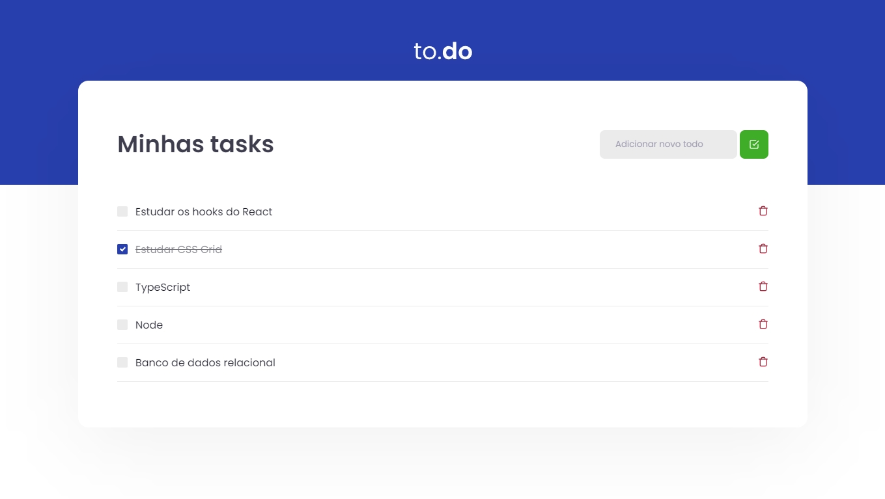

## 01 Desafio Ignite Reactjs

Uma pequena aplicação de atividades a fazer. 
Desafio do curso Ignite da Rocketseat.

__Desafio proposto:__ o objeto era praticar um pouco mais a manipulação do estado no react criando as seguintes funcionalidades:
- Adicionar tarefa;
- Marcar como concluída;
- Remover tarefa;

  

